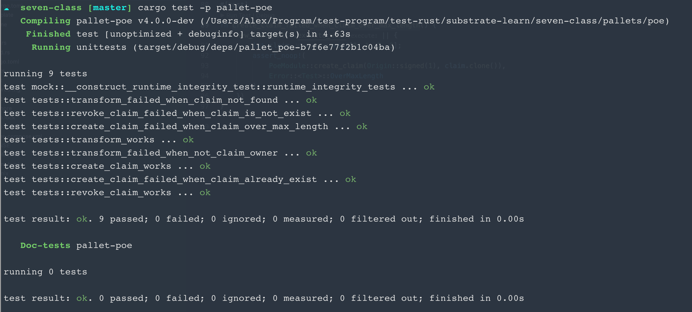

```
cargo test -p pallet-poe
```
结果说明:

第一题:

  test tests::transform_failed_when_claim_not_found

  test tests::revoke_claim_failed_when_claim_is_not_exist

  test tests::transform_works

  test tests::transform_failed_when_not_claim_owner

  test tests::create_claim_works

  test tests::create_claim_failed_when_claim_already_exist
  
  test tests::revoke_claim_works

第二题:

  test tests::create_claim_failed_when_claim_over_max_length

执行命令结果：
